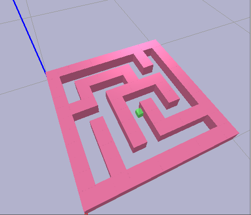
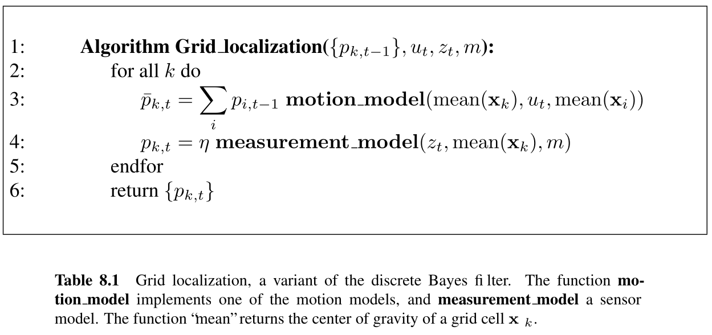
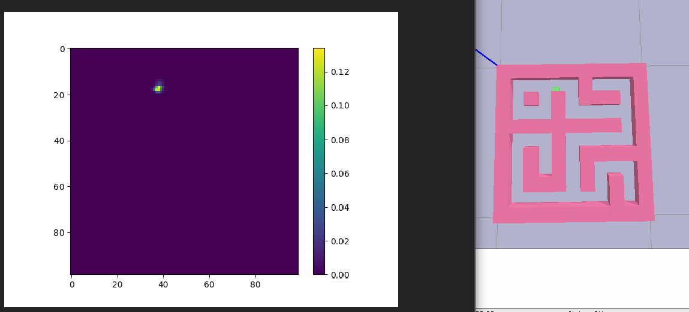
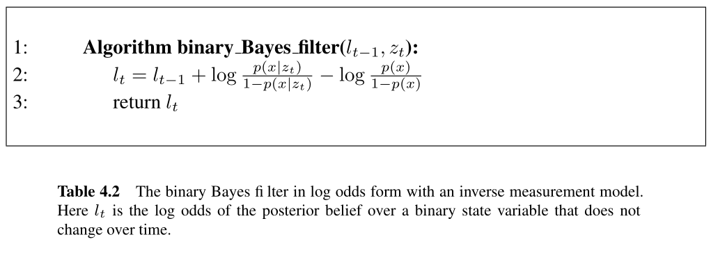
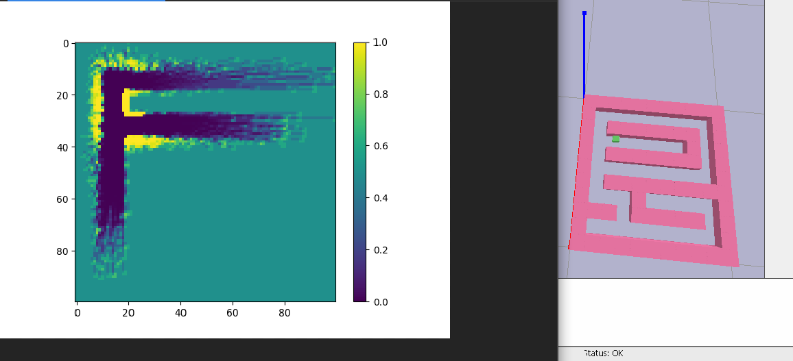

# Lidar in pybullet – Robot control, homework 4
Author: [Piotr Krzywicki](mailto:p.krzywicki@uw.edu.pl)

This is the fourth graded homework. Deadline is 25th January 08:00.

## General idea
The idea of the excercise is to present type of problems that robotics engineer will face when deploying mobile robot.

We will try to navigate the mobile robot in the maze in two different settings:
1. Localization problem:
* we know the map of the environment
* we don't know the position of the robot
* motion model of the robot is stochastic
* we have noisy lidar measurement
* we want to navigate the robot to the specific position on the map

2. Mapping problem:
* We don't know the map of the environment
* we know the exact position of the robot
* motion model of the robot is deterministic
* we have noisy lidar measurement
* we want to navigate the robot to the specific coordinates 

## Environment description
The environment is a gridworld, containing a simple maze and the agent. 
It is implemented in pybullet because of the possible visualization and ray-casting.
The maze has dimensions of 11x11, but the agent is small enough to navigate this maze using a grid with dimensions of 110x110.



it contains methods for:
* obtaining the current position of the agent – use only in mapping setting
* obtaining the current noisy lidar readings from the agent position
* obtaining ideal lidar readings from given position – use only in localization setting
* converting coordinates between xy in pybullet and row/col in gridmap
* performing step of up/down/right/left of the agent on the grid
* checking whether we are successful, i.e. close to the goal position

## 0. A* algorithm implementation task
First implement the [A* graph search algorithm](https://en.wikipedia.org/wiki/A*_search_algorithm), that will guide agent in the following tasks to the goal position.
To this end implement the following function:
```python
def a_star_search(occ_map: np.ndarray, start: Tuple[int, int], end: Tuple[int, int]) -> Dict[Tuple[int, int], Tuple[int, int]]:
    """
    Implements the A* search with heuristic function being distance from the goal position.
    :param occ_map: Occupancy map, 1 – field is occupied, 0 – is not occupied.
    :param start: Start position from which to perform search
    :param end: Goal position to which we want to find the shortest path
    :return: The dictionary containing at least the optimal path from start to end in the form:
        {start: intermediate, intermediate: ..., almost: goal} 
    """
```

## 1. Localization task
Solve the localization task while navigating to the goal position from the random, unknown start position with noisy movement model.
To this end use Bayes filter. Look at the ```Environment``` class code for noise model. Calculate approximate probabilities of measurement model by partitioning the normal distribution.



Please, see chapter 8 of [Probabilistic Robotics](https://docs.ufpr.br/~danielsantos/ProbabilisticRobotics.pdf), it will be easier for you to get a grasp what is going on.
### Example by visualization


### Requirements:
* Don't use position function of the environment
* You can use known map of the environment
* You can use noisy lidar model from agent position
* You can use ideal lidar model any times you want, but without using position function
* Use file ```localization_agent_task.py``` as a template, don't change ```main``` function

## 2. Mapping task
Solve the mapping task while navigating to the goal position.
To approximate the map state, assumine that sensor observations are independent for each grid-cel.
Then use Bayes filter for binary estimation with static state.
You don't have to calculate exact probabilities ```p(x | z)```, you can approximate it by constant, it should work well.


Please, see chapter 4 and chapter 9 of [Probabilistic Robotics](https://docs.ufpr.br/~danielsantos/ProbabilisticRobotics.pdf), it will be easier for you to get a grasp what is going on.

In task 2. we also allow for different solution than Bayes filter. 
But simple heuristics that just put observations of the lidar into the grid should not work with noise model we have.
We tested the simple ones, nevertheless, we welcome you to try more complex heuristics.

### Example by visualization


### Requirements:
* Don't use exact lidar function
* Don't use known map of the environment
* You can use noisy lidar model from agent position
* You can't use ideal lidar model
* Use file ```mapping_agent_task.py``` as a template, don't change ```main``` function

## Note on SLAM – simultaneous localization and mapping (non graded, not required)
In the real world, the assumption as in localization or mapping task are rarely met.
In practice, when deploying the mobile robot you will simultaneously approximate the map of the environment and try to localize your robot inside it.
In other words, you don't have the map, nor the position. Try to come up with the ideas how to combine solutions from tasks 1 and 2 to solve the SLAM problem.
You can discuss some of your ideas and try to implement it. 

Please, see chapter 10 of [Probabilistic Robotics](https://docs.ufpr.br/~danielsantos/ProbabilisticRobotics.pdf), it will be easier for you to get a grasp what is going on.

## Points
* 10% for A*
* 40% for localization
* 40% for mapping
* 10% discretionary
  * i.e. code quality, visualizations, methods selection, readme, ease of checking your homework

## References
1. Probabilistic Robotics by Sebastian Thrun, Wolfram Burgard and Dieter Fox, MIT Press, ISBN 0-262-20162-3.
